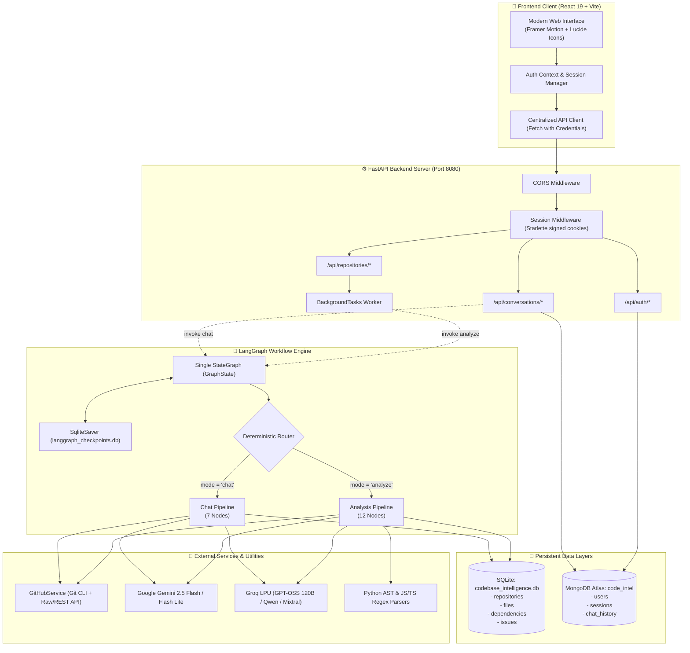
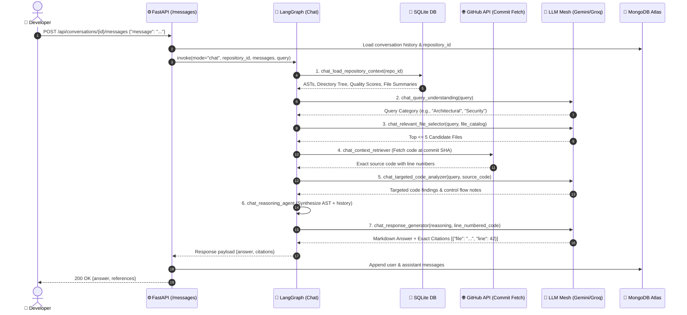
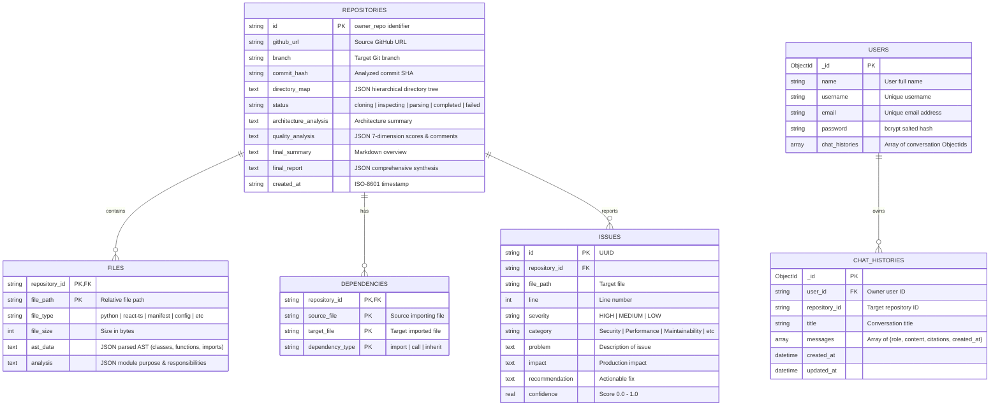

# 🧠 CodeIntel — Intelligent Codebase Analysis & Exploration System

> An enterprise-grade, multi-agent AI platform that **deeply understands any GitHub repository** — mapping its architecture, extracting AST symbols, calculating 7-dimension code quality scores, auditing security vulnerabilities, and enabling conversational exploration with exact source-level citations.

---

## 📑 Table of Contents

1. [Executive Overview](#-executive-overview)
2. [End-to-End System Architecture](#-end-to-end-system-architecture)
3. [LangGraph Single-Graph Design](#-langgraph-single-graph-design)
4. [Deep Node-by-Node Engine Walkthrough](#-deep-node-by-node-engine-walkthrough)
   - [Unified Graph State (`GraphState`)](#unified-graph-state-graphstate)
   - [Deterministic Router Node](#deterministic-router-node)
   - [Repository Analysis Pipeline (12 Nodes)](#-repository-analysis-pipeline-12-nodes)
   - [Conversational Chat Pipeline (7 Nodes)](#-conversational-chat-pipeline-7-nodes)
5. [Complete REST API Reference](#-complete-rest-api-reference)
   - [Authentication & Session Routes](#1-authentication--session-routes)
   - [Repository Management Routes](#2-repository-management-routes)
   - [Codebase Analysis & Intelligence Routes](#3-codebase-analysis--intelligence-routes)
   - [Conversational Chat & Citations Routes](#4-conversational-chat--citations-routes)
6. [Database Models & Storage Strategy](#-database-models--storage-strategy)
7. [LLM Orchestration & Multi-Tier Fallback Chain](#-llm-orchestration--multi-tier-fallback-chain)
8. [Directory Structure](#-directory-structure)
9. [Getting Started & Local Setup](#-getting-started--local-setup)
10. [Security & Fault-Tolerance Engineering](#-security--fault-tolerance-engineering)

---

## 🗺️ Executive Overview

Traditional static application security testing (SAST) and code linters only check for hardcoded regex patterns or static rule violations. They cannot reason about holistic architectural trade-offs, trace cross-file logic, or answer developer questions about implementation choices.

**CodeIntel** bridges this gap using a **stateful, multi-agent LangGraph workflow**:

```
                                  ┌────────────────────────┐
                                  │   GitHub Repository    │
                                  └───────────┬────────────┘
                                              │
                                              ▼
┌───────────────────────────────────────────────────────────────────────────────────────────┐
│                                REPOSITORY ANALYSIS PIPELINE                               │
│  Validate ──► Clone ──► Inspect ──► Classify ──► AST Parse ──► File Summarize             │
│     ▲                                                                │                    │
│     │                                                                ▼                    │
│  Persist DB ◄── Synthesize Report ◄── Issue Audit ◄── Quality Score ◄── Dependency Map    │
└─────────────────────────────────────────────┬─────────────────────────────────────────────┘
                                              │
                                              ▼
┌───────────────────────────────────────────────────────────────────────────────────────────┐
│                               CONVERSATIONAL CHAT PIPELINE                                │
│  User Query ──► Intent Classification ──► File Selection ──► GitHub API Code Retrieval    │
│                                                                      │                    │
│                                                                      ▼                    │
│  Exact Citations (File:Line) ◄── Response Generator ◄── Reasoning ◄── Targeted Analysis   │
└───────────────────────────────────────────────────────────────────────────────────────────┘
```

---

## 🏛️ End-to-End System Architecture

CodeIntel combines **FastAPI**, **LangGraph**, **SQLite (relational repository intelligence)**, **MongoDB Atlas (user accounts & chat history)**, and a **multi-model LLM fallback mesh (Google Gemini + Groq)**.

### High-Level Architecture Diagram



---

## 🔀 LangGraph Single-Graph Design

Rather than maintaining separate, disconnected execution graphs for repository analysis and conversational chat, CodeIntel employs a **Unified Single-Graph Architecture**.

```mermaid
flowchart LR
    Start([START]) --> RouterNode["route_request\n(Deterministic Router)"]
    
    %% Branching
    RouterNode -->|mode == 'analyze'| N1["1. analysis_validate_repository"]
    RouterNode -->|mode == 'chat'| C1["1. chat_load_repository_context"]

    %% Analysis Subgraph
    subgraph AnalysisFlow ["🔬 Repository Analysis Pipeline (Background Worker)"]
        N1 --> N2["2. analysis_clone_repository"]
        N2 --> N3["3. analysis_repository_inspector"]
        N3 --> N4["4. analysis_file_classifier"]
        N4 --> N5["5. analysis_source_parser"]
        N5 --> N6["6. analysis_file_analysis"]
        N6 --> N7["7. analysis_dependency_analyzer"]
        N7 --> N8["8. analysis_architecture_analyzer"]
        N8 --> N9["9. analysis_quality_analyzer"]
        N9 --> N10["10. analysis_issue_detector"]
        N10 --> N11["11. analysis_repository_synthesizer"]
        N11 --> N12["12. analysis_persist_analysis"]
    end

    %% Chat Subgraph
    subgraph ChatFlow ["💬 Conversational Chat Pipeline (Synchronous LLM Stream)"]
        C1 --> C2["2. chat_query_understanding"]
        C2 --> C3["3. chat_relevant_file_selector"]
        C3 --> C4["4. chat_context_retriever"]
        C4 --> C5["5. chat_targeted_code_analyzer"]
        C5 --> C6["6. chat_reasoning_agent"]
        C6 --> C7["7. chat_response_generator"]
    end

    N12 --> EndAnalysis([END])
    C7 --> EndChat([END])
```



---

## 🔬 Deep Node-by-Node Engine Walkthrough

### Unified Graph State (`GraphState`)

All data shared across nodes is defined in `server/graph/state.py` via Python's `TypedDict`:

```python
class GraphState(TypedDict):
    # -- Routing Mode --
    mode: str  # "analyze" | "chat"

    # -- Analysis Pipeline State (mode == "analyze") --
    repository_id: str                      # Unique ID formatted as "{owner}_{repo}"
    repository_url: Optional[str]           # Canonical GitHub repository URL
    branch: Optional[str]                   # Target branch (default: "main")
    commit_hash: Optional[str]              # Exact git commit SHA from clone
    repository_path: Optional[str]          # Local path on server (/server/temp_clones/...)
    directory_tree: Optional[dict]          # Hierarchical JSON tree of directories & files
    files: Optional[list]                   # Flat list of relative file paths
    file_metadata: Optional[dict]           # Dictionary mapping file path -> {size, type, name}
    ast_data: Optional[dict]                # Parsed structural AST data (classes, functions, imports)
    file_analysis: Optional[dict]           # LLM summaries of module purpose & responsibilities
    dependencies: Optional[dict]            # Directed cross-file import graph
    architecture_analysis: Optional[dict]   # Architectural style, layers, auth, DB detection
    quality_analysis: Optional[dict]        # 7-dimension scores (1.0 - 10.0) + rationale comments
    issues: Optional[list]                  # List of security/performance/design issues
    recommendations: Optional[list]         # Actionable remediation advice
    final_summary: Optional[str]            # Markdown overview report
    final_report: Optional[dict]            # Complete synthesized payload
    analysis_status: Optional[str]          # Current status string

    # -- Conversational Pipeline State (mode == "chat") --
    conversation_id: Optional[str]          # MongoDB chat conversation ID
    messages: Annotated[list, add_messages] # Multi-turn message history with LangGraph reducer
    user_query: Optional[str]               # Latest question prompt from the user
    query_type: Optional[str]               # Intent classification category
    relevant_files: Optional[list]          # Top <=5 files identified for the query
    relevant_symbols: Optional[list]        # Extracted symbols/functions
    retrieved_context: Optional[list]       # Source code fetched from local cache or GitHub API
    reasoning: Optional[str]                # Intermediate reasoning chain findings
    answer: Optional[str]                   # Final conversational answer (Markdown)
    citations: Optional[list]               # Exact source citations: [{"file": str, "line": int}]

    # -- Shared State --
    errors: list                            # Accumulator for non-fatal execution errors
```

---

### Deterministic Router Node

- **Function**: `route_request(state: GraphState) -> Dict[str, Any]`
- **Location**: `server/graph/router.py`
- **Logic**: Inspects incoming state keys to determine execution branch deterministically without incurring LLM cost:
  1. If `github_url` is provided without completed state, or `analysis_status != "completed"`: routes to `"analyze"`.
  2. If `conversation_id`, `user_query`, or messages list are present: routes to `"chat"`.
  3. Returns `{"mode": "analyze"}` or `{"mode": "chat"}`.

---

### 🔬 Repository Analysis Pipeline (12 Nodes)

#### Node 1: `analysis_validate_repository`
- **File**: `server/graph/nodes/analysis/repository.py`
- **Logic**:
  - Validates that the URL starts with `https://github.com/`.
  - Splits the URL into `owner` and `repo` components.
  - Generates the standard identifier: `repository_id = f"{owner}_{repo}"`.
  - Registers/updates the repository record in SQLite with status `cloning`.
- **State Output**: `repository_id`, `repository_url`, `branch`, `analysis_status="cloning"`.

#### Node 2: `analysis_clone_repository`
- **File**: `server/graph/nodes/analysis/repository.py` & `server/services/github_service.py`
- **Logic**:
  - Spawns Git CLI command: `git clone --branch <branch> --depth 1 <url> <dest_path>`.
  - If target branch fails, falls back to default branch clone.
  - Injects `GITHUB_TOKEN` for authenticated clone if private repository support is needed.
  - Executes `git -C <dest_path> rev-parse HEAD` to capture the immutable `commit_hash`.
  - Updates SQLite repository status to `inspecting`.
- **State Output**: `repository_path`, `commit_hash`, `analysis_status="inspecting"`.

#### Node 3: `analysis_repository_inspector`
- **File**: `server/graph/nodes/analysis/inspection.py`
- **Logic**:
  - Recursively walks the cloned directory tree (`build_tree`).
  - Filters out ignored directories: `.git`, `node_modules`, `venv`, `.venv`, `__pycache__`, `.agents`, `.gemini`, `dist`, `build`.
  - Computes file sizes in bytes.
  - Flattens the hierarchy into a fast lookup list of relative file paths and `file_metadata` dictionaries.
- **State Output**: `directory_tree`, `files`, `file_metadata`, `analysis_status="inspecting"`.

#### Node 4: `analysis_file_classifier`
- **File**: `server/graph/nodes/analysis/inspection.py`
- **Logic**:
  - Classifies every file path based on filename extensions and manifest patterns:
    - **Manifests**: `package.json`, `requirements.txt`, `pyproject.toml`, `go.mod`, `Cargo.toml`, `composer.json`, `pom.xml`.
    - **Docker / Infra**: `Dockerfile`, `docker-compose.yml`.
    - **Environment**: `.env`, `.env.example`.
    - **Programming Languages**: Python (`.py`), JavaScript (`.js`, `.mjs`), TypeScript (`.ts`), React (`.jsx`, `.tsx`), Java (`.java`), C/C++ (`.c`, `.cpp`, `.h`, `.hpp`).
    - **Web / Static**: HTML, CSS, SCSS.
    - **Configs / Docs**: JSON, YAML, TOML, Markdown, PDF, TXT.
    - **Binaries**: Images, zip archives, executables, compiled libraries (`.so`, `.dll`).
- **State Output**: `file_metadata` (enriched with classification type), `analysis_status="parsing"`.

#### Node 5: `analysis_source_parser`
- **File**: `server/graph/nodes/analysis/parsing.py`
- **Logic**:
  - **Python AST Engine (`parse_python_file`)**:
    - Executes `ast.parse()` on Python source code.
    - Traverses nodes with `ast.walk()`.
    - Extracts `ast.ClassDef` (class name, bases, methods, line numbers).
    - Extracts `ast.FunctionDef` (function name, arguments, decorators, line numbers).
    - Extracts `ast.Import` and `ast.ImportFrom` (module dependencies).
    - Extracts `ast.Call` (invoked symbols).
  - **JS / TS / React Parser (`parse_jsts_file`)**:
    - Uses regex pattern engines to extract ES6 `import` & CommonJS `require()`.
    - Detects standard and arrow functions (`function name(...)` and `const name = (...) =>`).
    - Detects ES6 classes (`class Name`).
    - Detects React Hooks (`use[A-Z]\w+`, e.g., `useState`, `useEffect`, custom hooks).
    - Detects React Component functions and `export default` declarations.
    - Constructs line-number indices.
  - **Generic Fallback**: Extracts import statements from other file formats.
- **State Output**: `ast_data`, `analysis_status="analyzing"`.

#### Node 6: `analysis_file_analysis`
- **File**: `server/graph/nodes/analysis/analysis.py`
- **Logic**:
  - To optimize token usage and avoid rate limits, selects the top 15 most substantial source code files sorted by byte size.
  - Extracts the first 150 lines of code preview along with parsed AST symbols.
  - Invokes **Groq LLM Reasoning Chain** with structured JSON output parser:
    ```json
    {
      "purpose": "A one-sentence description of what this module does.",
      "responsibilities": ["Primary responsibility 1", "Primary responsibility 2"],
      "summary": "Implementation details, design patterns, and highlights."
    }
    ```
  - For non-code files, populates deterministic structural metadata summaries.
- **State Output**: `file_analysis`, `analysis_status="analyzing_architecture"`.

#### Node 7: `analysis_dependency_analyzer`
- **File**: `server/graph/nodes/analysis/quality.py`
- **Logic**:
  - Cross-references parsed imports in every file against the known file catalog of the repository.
  - Resolves relative imports and module base names (e.g. `import auth_service` -> `services/auth_service.py`).
  - Constructs a directed graph mapping `source_file -> {target_file: "import"}`.
- **State Output**: `dependencies`, `analysis_status="quality_check"`.

#### Node 8: `analysis_architecture_analyzer`
- **File**: `server/graph/nodes/analysis/architecture.py`
- **Logic**:
  - Computes file-type distribution across the codebase (e.g., Python: 24, JavaScript: 18).
  - Reads package manifests (`package.json`, `requirements.txt`, `pyproject.toml`) to identify dependencies and frameworks (FastAPI, React, Express, Django, etc.).
  - Reads root-level folder layout.
  - Invokes LLM reasoning to infer:
    - **Architectural Style**: Monolithic, Microservices, Serverless, Full-Stack Single Repo.
    - **Frontend / Backend Separation**: Layer boundaries.
    - **Database Layer**: SQLite, PostgreSQL, MongoDB, ORMs (SQLAlchemy, Prisma, Mongoose).
    - **Authentication Flow**: Session cookies, JWT tokens, OAuth.
    - **Overview**: Holistic architectural narrative.
- **State Output**: `architecture_analysis`, `analysis_status="quality_check"`.

#### Node 9: `analysis_quality_analyzer`
- **File**: `server/graph/nodes/analysis/quality.py`
- **Logic**:
  - Evaluates the repository codebase across **7 core dimensions** on a scale from `1.0` to `10.0`:
    1. **Readability**: Naming conventions, style consistency, comments.
    2. **Maintainability**: Modularity, coupling, duplication, cyclomatic complexity.
    3. **Scalability**: Bottlenecks, asynchronous operations, query patterns.
    4. **Security**: Hardcoded secrets, input sanitation, dependency vulnerabilities.
    5. **Performance**: Loop complexity, memory efficiency, caching strategies.
    6. **Testing**: Unit/integration testing frameworks and test coverage indicators.
    7. **Documentation**: Setup guides, inline docstrings, README quality.
  - Generates numerical scores along with justification comments for each dimension.
- **State Output**: `quality_analysis`, `analysis_status="detecting_issues"`.

#### Node 10: `analysis_issue_detector`
- **File**: `server/graph/nodes/analysis/analysis.py`
- **Logic**:
  - Passes quality scores, architecture overview, and file summaries to the **Gemini Elite Accuracy Chain**.
  - Identifies 3 to 7 concrete issues categorized as `Security`, `Performance`, `Scalability`, `Maintainability`, `Readability`, `Testing`, or `Documentation`.
  - Assigns severity (`HIGH`, `MEDIUM`, `LOW`), exact file target, line number, impact analysis, actionable remediation instructions, and confidence score.
- **State Output**: `issues`, `analysis_status="synthesizing"`.

#### Node 11: `analysis_repository_synthesizer`
- **File**: `server/graph/nodes/analysis/repository.py`
- **Logic**:
  - Aggregates metrics, file counts, architectural style, 7-dimension scores, detected issues, and technology breakdown into a structured Markdown document (`final_summary`).
  - Packages the comprehensive `final_report` JSON object containing overview, directory tree, quality scores, issues, and recommendations.
- **State Output**: `final_summary`, `final_report`, `analysis_status="synthesizing"`.

#### Node 12: `analysis_persist_analysis`
- **File**: `server/graph/nodes/analysis/repository.py`
- **Logic**:
  - Executes atomic SQLite database transactions:
    - Updates `repositories` table with `directory_map`, `architecture_analysis`, `quality_analysis`, `final_summary`, `final_report`, and sets status to `completed`.
    - Inserts all file records into `files` table with parsed `ast_data` and LLM `analysis`.
    - Inserts directed dependency relations into `dependencies` table.
    - Inserts all discovered issue records into `issues` table.
  - **Cold Storage Optimization**: Deletes the temporary cloned workspace folder (`server/temp_clones/{repo_id}`) from disk to prevent server disk exhaustion.
- **State Output**: `analysis_status="completed"`.

---

### 💬 Conversational Chat Pipeline (7 Nodes)



#### Node 1: `chat_load_repository_context`
- **File**: `server/graph/nodes/chat/retrieval.py`
- **Logic**:
  - Reads repository intelligence directly from SQLite using `repository_id`.
  - Reconstructs file metadata, AST symbol maps, module summaries, dependency mappings, quality scores, and architectural overview.
  - Injects hydrated repository context directly into the graph state.
- **State Output**: `repository_url`, `branch`, `commit_hash`, `directory_tree`, `files`, `file_metadata`, `ast_data`, `file_analysis`, `dependencies`, `architecture_analysis`, `quality_analysis`, `issues`, `final_summary`, `final_report`.

#### Node 2: `chat_query_understanding`
- **File**: `server/graph/nodes/chat/chat.py`
- **Logic**:
  - Analyzes the latest user query using Groq reasoning.
  - Classifies query intent into 6 standard categories:
    1. **General**: Overview questions (e.g., *"What does this repository do?"*).
    2. **File-specific**: Inquiries about a specific file or class (e.g., *"Explain auth_service.py"*).
    3. **Architectural**: High-level component interactions (e.g., *"How is auth handled between client and server?"*).
    4. **Debugging**: Bug hunting and error diagnostics (e.g., *"Why does the database connection timeout?"*).
    5. **Security**: Vulnerability queries (e.g., *"Are passwords hashed securely?"*).
    6. **Modification**: Code extension or feature addition (e.g., *"How do I add a new OAuth provider?"*).
- **State Output**: `query_type`, `user_query`.

#### Node 3: `chat_relevant_file_selector`
- **File**: `server/graph/nodes/chat/retrieval.py`
- **Logic**:
  - Formats candidate file paths along with their one-sentence LLM-generated summaries.
  - Prompts the LLM to prune the file catalog down to a **minimal set of ≤5 files** strictly relevant to answering the query.
  - If LLM pruning fails, falls back to keyword matching against filenames.
- **State Output**: `relevant_files`.

#### Node 4: `chat_context_retriever`
- **File**: `server/graph/nodes/chat/retrieval.py` & `server/services/github_service.py`
- **Logic**:
  - **Two-Tier Retrieval Strategy**:
    1. **Local Disk Cache**: Checks if local clone directory exists at `./server/temp_clones/{repo_id}`.
    2. **On-Demand GitHub API Fetch**: If the local clone was deleted (cold storage), uses `GitHubService.fetch_file_content()` to retrieve the exact file content asynchronously via GitHub Raw / REST API at the immutable `commit_hash` that was originally analyzed.
  - Guarantees source code consistency even if the remote repository has newer commits pushed since analysis.
- **State Output**: `retrieved_context` (array of `{"file": str, "code": str}`).

#### Node 5: `chat_targeted_code_analyzer`
- **File**: `server/graph/nodes/chat/chat.py`
- **Logic**:
  - Injects retrieved source files and user query into the **Gemini Elite Accuracy Chain**.
  - Extracts key functions, variables, control flow branches, and potential edge cases specifically addressing the user query.
- **State Output**: `reasoning` (intermediate targeted findings).

#### Node 6: `chat_reasoning_agent`
- **File**: `server/graph/nodes/chat/chat.py`
- **Logic**:
  - Synthesizes findings from targeted code analysis, AST symbol tables, query classification, and previous multi-turn conversation history.
  - Prepares structured reasoning context for final answer synthesis.
- **State Output**: `reasoning` (consolidated context).

#### Node 7: `chat_response_generator`
- **File**: `server/graph/nodes/chat/chat.py`
- **Logic**:
  - Formats retrieved source code files with explicit **1-indexed line numbers** (`1: import ...`, `2: class ...`).
  - Prompts Gemini Elite to write a comprehensive, friendly Markdown response with syntax-highlighted code snippets.
  - Enforces strict extraction of exact source citations:
    ```json
    {
      "answer": "Your detailed Markdown response...",
      "citations": [
        { "file": "server/main.py", "line": 35 },
        { "file": "server/graph/router.py", "line": 18 }
      ]
    }
    ```
- **State Output**: `answer`, `citations`.

---

## 🔌 Complete REST API Reference

All backend routes are exposed by FastAPI on port `8080` (prefixed with `/api`).

---

### 1. Authentication & Session Routes

#### `POST /api/auth/register`
- **Purpose**: Creates a new user account, hashes the password using bcrypt, stores the user in MongoDB Atlas, and establishes an authenticated session cookie.
- **Authentication**: None required.
- **Request Body**:
  ```json
  {
    "name": "Alex Developer",
    "username": "alexdev",
    "email": "alex@example.com",
    "password": "SecurePassword123!"
  }
  ```
- **Response `200 OK`**:
  ```json
  {
    "message": "User signup successful",
    "user": {
      "name": "Alex Developer",
      "email": "alex@example.com",
      "username": "alexdev"
    }
  }
  ```
- **Error Responses**:
  - `400 Bad Request`: `{"error": "User already exists"}`
  - `500 Internal Server Error`: `{"error": "..."}`

---

#### `POST /api/auth/login`
- **Purpose**: Authenticates credentials against bcrypt hash in MongoDB and issues a signed session cookie (`vantaguard_session`).
- **Authentication**: None required.
- **Request Body**:
  ```json
  {
    "email": "alex@example.com",
    "password": "SecurePassword123!"
  }
  ```
- **Response `200 OK`**:
  ```json
  {
    "message": "User login successful",
    "user": {
      "name": "Alex Developer",
      "email": "alex@example.com",
      "username": "alexdev"
    }
  }
  ```
- **Error Responses**:
  - `400 Bad Request`: `{"error": "User does not exist"}` or `{"error": "Password did not match"}`

---

#### `POST /api/auth/logout`
- **Purpose**: Clears the current user session.
- **Authentication**: None required.
- **Response `200 OK`**:
  ```json
  {
    "message": "Logged out successfully"
  }
  ```

---

#### `GET /api/auth/me`
- **Purpose**: Validates the current session cookie and returns user profile metadata.
- **Authentication**: Required (Cookie: `vantaguard_session`).
- **Response `200 OK`**:
  ```json
  {
    "authenticated": true,
    "user": {
      "name": "Alex Developer",
      "email": "alex@example.com",
      "username": "alexdev"
    }
  }
  ```
- **Response `401 Unauthorized`**:
  ```json
  {
    "authenticated": false
  }
  ```

---

### 2. Repository Management Routes

#### `POST /api/repositories`
- **Purpose**: Registers a GitHub repository in SQLite and prepares it for analysis.
- **Authentication**: Required.
- **Request Body**:
  ```json
  {
    "github_url": "https://github.com/fastapi/fastapi",
    "branch": "master"
  }
  ```
- **Response `200 OK`**:
  ```json
  {
    "repository_id": "fastapi_fastapi",
    "status": "cloned_registered"
  }
  ```
- **Error Responses**:
  - `400 Bad Request`: `{"error": "Invalid GitHub URL"}`

---

#### `GET /api/repositories`
- **Purpose**: Lists all repositories registered in the system ordered by creation timestamp.
- **Authentication**: Required.
- **Response `200 OK`**:
  ```json
  {
    "repositories": [
      {
        "id": "fastapi_fastapi",
        "github_url": "https://github.com/fastapi/fastapi",
        "branch": "master",
        "commit_hash": "4b82d3e918c50fa897e93737b6070669145695cf",
        "status": "completed",
        "created_at": "2026-09-08T00:15:22.123456"
      }
    ]
  }
  ```

---

#### `GET /api/repositories/{repository_id}`
- **Purpose**: Fetches complete database record for a single repository, parsing stored JSON fields.
- **Authentication**: Required.
- **Response `200 OK`**:
  ```json
  {
    "repository": {
      "id": "fastapi_fastapi",
      "github_url": "https://github.com/fastapi/fastapi",
      "branch": "master",
      "commit_hash": "4b82d3e...",
      "status": "completed",
      "architecture_analysis": "FastAPI ASGI Web Framework...",
      "quality_analysis": {
        "readability_score": 9.2,
        "maintainability_score": 8.8,
        "scalability_score": 9.5,
        "security_score": 8.9,
        "performance_score": 9.4,
        "testing_score": 9.0,
        "documentation_score": 9.8
      },
      "final_summary": "# Repository Overview: fastapi_fastapi\n...",
      "final_report": { ... },
      "directory_map": { ... },
      "created_at": "2026-09-08T00:15:22.123456"
    }
  }
  ```
- **Response `404 Not Found`**:
  ```json
  {
    "error": "Repository not found"
  }
  ```

---

#### `DELETE /api/repositories/{repository_id}`
- **Purpose**: Deletes the repository and cascades deletion across all child tables (`files`, `dependencies`, `issues`).
- **Authentication**: Required.
- **Response `200 OK`**:
  ```json
  {
    "message": "Repository deleted successfully"
  }
  ```

---

### 3. Codebase Analysis & Intelligence Routes

#### `POST /api/repositories/{repository_id}/analyze`
- **Purpose**: Triggers asynchronous background execution of the 12-node LangGraph Analysis Pipeline.
- **Authentication**: Required.
- **Response `200 OK`**:
  ```json
  {
    "repository_id": "fastapi_fastapi",
    "status": "analysis_started"
  }
  ```

---

#### `GET /api/repositories/{repository_id}/status`
- **Purpose**: Polling endpoint used by the frontend to monitor analysis progress in real time.
- **Authentication**: Required.
- **Response `200 OK`**:
  ```json
  {
    "status": "inspecting"
  }
  ```
  *(Possible values: `cloning`, `inspecting`, `parsing`, `analyzing_files`, `analyzing_architecture`, `quality_check`, `detecting_issues`, `synthesizing`, `completed`, `failed`)*

---

#### `GET /api/repositories/{repository_id}/analysis`
- **Purpose**: Returns high-level quality scorecards and file counts.
- **Authentication**: Required.
- **Response `200 OK`**:
  ```json
  {
    "repository": { ... },
    "files_count": 142,
    "quality_scores": {
      "readability_score": 8.5,
      "readability_comment": "Consistent typing and docstrings.",
      "maintainability_score": 8.0,
      "maintainability_comment": "Clean modular routing layout.",
      "scalability_score": 8.5,
      "scalability_comment": "Asynchronous ASGI native handlers.",
      "security_score": 8.0,
      "security_comment": "Pydantic request sanitization active.",
      "performance_score": 8.5,
      "performance_comment": "High throughput async IO operations.",
      "testing_score": 7.5,
      "testing_comment": "Pytest suites present.",
      "documentation_score": 9.0,
      "documentation_comment": "Extensive Markdown tutorials."
    }
  }
  ```

---

#### `GET /api/repositories/{repository_id}/report`
- **Purpose**: Returns the full synthesized markdown report and executive summary.
- **Authentication**: Required.
- **Response `200 OK`**:
  ```json
  {
    "report": {
      "overview": "# Repository Overview: fastapi_fastapi...",
      "directory_tree": { ... },
      "quality_scores": { ... },
      "issues": [ ... ],
      "architecture": { ... },
      "recommendations": [ ... ]
    },
    "summary": "# Repository Overview: fastapi_fastapi\n\n**GitHub URL:** https://github.com/fastapi/fastapi..."
  }
  ```

---

#### `GET /api/repositories/{repository_id}/structure`
- **Purpose**: Returns the hierarchical directory tree for rendering in the interactive file explorer UI.
- **Authentication**: Required.
- **Response `200 OK`**:
  ```json
  {
    "directory_tree": {
      "name": "root",
      "type": "directory",
      "path": "",
      "children": [
        {
          "name": "fastapi",
          "type": "directory",
          "path": "fastapi",
          "children": [
            {
              "name": "applications.py",
              "type": "file",
              "path": "fastapi/applications.py",
              "size": 42150
            }
          ]
        }
      ]
    }
  }
  ```

---

#### `GET /api/repositories/{repository_id}/issues`
- **Purpose**: Returns all issues discovered during security and quality audits.
- **Authentication**: Required.
- **Response `200 OK`**:
  ```json
  {
    "issues": [
      {
        "id": "c71a39bf-6b3a-446a-8b92-88f5de1249b1",
        "file_path": "server/main.py",
        "line": 29,
        "severity": "MEDIUM",
        "category": "Security",
        "problem": "Hardcoded default fallback for SESSION_SECRET_KEY",
        "impact": "If environment variables fail to load, default secret key could allow session cookie forgery.",
        "recommendation": "Enforce startup check requiring non-empty SESSION_SECRET_KEY environment variable.",
        "confidence": 0.95
      }
    ]
  }
  ```

---

### 4. Conversational Chat & Citations Routes

#### `POST /api/repositories/{repository_id}/conversations`
- **Purpose**: Initiates a new conversation thread for a given repository and links it to the user in MongoDB.
- **Authentication**: Required.
- **Response `200 OK`**:
  ```json
  {
    "conversation_id": "66dd8e49f1b2c34a5e678901",
    "title": "Chat about fastapi_fastapi"
  }
  ```

---

#### `GET /api/repositories/{repository_id}/conversations`
- **Purpose**: Lists all active conversation threads the user has created for the repository.
- **Authentication**: Required.
- **Response `200 OK`**:
  ```json
  {
    "conversations": [
      {
        "conversation_id": "66dd8e49f1b2c34a5e678901",
        "title": "Chat about fastapi_fastapi",
        "updated_at": "2026-09-08 00:18:30.123456"
      }
    ]
  }
  ```

---

#### `GET /api/conversations/{conversation_id}`
- **Purpose**: Retrieves complete message history and citations for a conversation thread.
- **Authentication**: Required.
- **Response `200 OK`**:
  ```json
  {
    "conversation": {
      "_id": "66dd8e49f1b2c34a5e678901",
      "user_id": "66dd8d10f1b2c34a5e678899",
      "repository_id": "fastapi_fastapi",
      "title": "Chat about fastapi_fastapi",
      "messages": [
        {
          "role": "human",
          "content": "Where is the dependency injection system defined?",
          "created_at": "2026-09-08 00:19:00.000000"
        },
        {
          "role": "assistant",
          "content": "The dependency injection resolution logic in FastAPI is primarily implemented in `fastapi/dependencies/utils.py`...",
          "citations": [
            { "file": "fastapi/dependencies/utils.py", "line": 45 },
            { "file": "fastapi/routing.py", "line": 120 }
          ],
          "created_at": "2026-09-08 00:19:04.000000"
        }
      ],
      "created_at": "2026-09-08 00:18:30.000000",
      "updated_at": "2026-09-08 00:19:04.000000"
    }
  }
  ```

---

#### `DELETE /api/conversations/{conversation_id}`
- **Purpose**: Deletes the conversation document from MongoDB and unlinks it from the user record.
- **Authentication**: Required.
- **Response `200 OK`**:
  ```json
  {
    "message": "Conversation deleted successfully"
  }
  ```

---

#### `POST /api/conversations/{conversation_id}/messages`
- **Purpose**: Sends a question to the AI, invokes the 7-node LangGraph Chat Pipeline, stores the message pair in MongoDB, and returns the response with exact file and line citations.
- **Authentication**: Required.
- **Request Body**:
  ```json
  {
    "message": "How does the single-graph router decide between analyze and chat modes?"
  }
  ```
- **Response `200 OK`**:
  ```json
  {
    "answer": "The router logic is implemented in `server/graph/router.py` within the `route_request()` function.\n\nIt inspects the state fields:\n1. If `github_url` is provided without completed status, it sets `mode = 'analyze'`.\n2. If `conversation_id`, `user_query`, or message history is present, it sets `mode = 'chat'`.\n\nThe conditional edge `route_mode` then directs execution to `analysis_validate_repository` or `chat_load_repository_context`.",
    "references": [
      {
        "file": "server/graph/router.py",
        "line": 5
      },
      {
        "file": "server/graph/graph.py",
        "line": 88
      }
    ]
  }
  ```
- **Error Responses**:
  - `404 Not Found`: `{"error": "Conversation not found"}`
  - `500 Internal Server Error`: `{"error": "Failed to run chat agent: ..."}`

---

## 💾 Database Models & Storage Strategy

CodeIntel uses a **hybrid polyglot persistence architecture**:



---

## 🤖 LLM Orchestration & Multi-Tier Fallback Chain

To guarantee 99.9% uptime and avoid API quota depletion or provider outages, CodeIntel configures a **dynamic multi-tier fallback chain** across Google Gemini and Groq LPUs (`server/core/llms.py`):


---

## 📁 Directory Structure

```
CodeIntel/
├── client/                          # 🎨 React 19 + Vite Frontend
│   ├── src/
│   │   ├── App.jsx                  # Root layout with sidebar navigation & routes
│   │   ├── api.js                   # Centralized API fetcher with credentials
│   │   ├── index.css                # Custom glassmorphic dark design system
│   │   ├── context/
│   │   │   └── AuthContext.jsx      # Global user authentication context
│   │   └── pages/
│   │       ├── AuthPage.jsx         # Login & registration forms
│   │       ├── DashboardPage.jsx    # Repository catalog & background analysis polling
│   │       ├── AnalysisPage.jsx     # 5-tab analysis: Overview, Tree, Quality, Issues, Report
│   │       └── ChatPage.jsx         # Multi-conversation chat with split citation panel
│   ├── package.json
│   └── vite.config.js
│
├── server/                          # ⚙️ FastAPI + LangGraph Backend
│   ├── main.py                      # REST API endpoints & server setup
│   ├── core/
│   │   ├── llms.py                  # Gemini + Groq multi-tier fallback chains
│   │   └── mongo.py                 # MongoDB Atlas client & collections
│   ├── database/
│   │   └── sqlite_manager.py        # SQLite ORM for repository intelligence
│   ├── graph/
│   │   ├── state.py                 # Unified GraphState TypedDict definition
│   │   ├── router.py                # Deterministic route_request entry node
│   │   ├── graph.py                 # Single-graph builder with SqliteSaver checkpointer
│   │   └── nodes/
│   │       ├── analysis/            # 12 Repository Analysis Pipeline Nodes
│   │       │   ├── repository.py    # validate, clone, synthesize, persist
│   │       │   ├── inspection.py    # directory tree crawler, file classifier
│   │       │   ├── parsing.py       # Python AST & JS/TS regex structural parsers
│   │       │   ├── analysis.py      # file summarization & issue detector
│   │       │   ├── architecture.py  # architecture style & manifest inference
│   │       │   └── quality.py       # dependency analyzer & 7-dimension quality scorer
│   │       └── chat/                # 7 Conversational Chat Pipeline Nodes
│   │           ├── retrieval.py     # SQLite context loader, file selector, code fetcher
│   │           └── chat.py          # query classification, targeted analysis, citations
│   ├── services/
│   │   └── github_service.py        # Git CLI clone & on-demand commit raw fetcher
│   ├── tools/
│   │   └── password_hashing.py      # bcrypt password hashing & verification
│   ├── logger/
│   │   └── logger.py                # Structured rotating logger
│   ├── exception/
│   │   └── exception.py             # Custom exception handler with line tracking
│   └── data/                        # Persistent SQLite database storage
│       ├── codebase_intelligence.db # Repository intelligence & AST tables
│       └── langgraph_checkpoints.db # LangGraph conversation checkpoints
│
├── .env                             # Environment API keys
├── requirements.txt                 # Python dependencies
└── README.md                        # Master documentation
```

---

## 🚀 Getting Started & Local Setup

### 1. Prerequisites
- **Python**: Version `3.11+`
- **Node.js**: Version `18+` (npm 9+)
- **Git**: Installed and added to system `PATH`
- **MongoDB Atlas**: Cluster URI connection string

### 2. Environment Configuration
Create a `.env` file in the root directory:

```env
# ==========================================
# LLM API Keys
# ==========================================
GOOGLE_API_KEY=AIzaSy...
GROQ_API_KEY=gsk_...

# ==========================================
# Database Configuration
# ==========================================
MONGODB_URL=mongodb+srv://<username>:<password>@cluster0.mongodb.net/?retryWrites=true&w=majority

# ==========================================
# Authentication & Security
# ==========================================
SESSION_SECRET_KEY=generate-a-strong-random-secret-key-32-chars

# ==========================================
# Optional GitHub Token (Private repos & higher rate limits)
# ==========================================
GITHUB_TOKEN=ghp_...
```

### 3. Backend Setup
```bash
# 1. Create and activate a virtual environment
python -m venv .venv
source .venv/bin/activate  # On Windows: .venv\Scripts\activate

# 2. Install dependencies
pip install -r requirements.txt

# 3. Run FastAPI server
uvicorn server.main:app --host 0.0.0.0 --port 8080 --reload
```
Interactive Swagger API documentation is available at `http://localhost:8080/docs`.

### 4. Frontend Setup
```bash
# 1. Navigate to client directory
cd client

# 2. Install npm packages
npm install

# 3. Start development server
npm run dev
```
Open `http://localhost:5173` in your browser.

---

## 🛡️ Security & Fault-Tolerance Engineering

1. **Password Security**: Passwords are never stored in plaintext. They are salted and hashed with `bcrypt` before storage in MongoDB.
2. **Session Integrity**: Session cookies (`vantaguard_session`) are cryptographically signed using Starlette's `SessionMiddleware` with `max_age=86400` (24-hour expiration) and `SameSite=Lax`.
3. **Cold Storage Disk Cleanup**: To prevent server disk exhaustion from cloned repositories, temporary git workspaces are deleted after SQLite persistence. Subsequent chat queries fetch source code on demand via GitHub raw API at the exact analyzed `commit_hash`.
4. **Token Cost Optimization**:
   - The analysis pipeline filters out non-code assets and analyzes only the top 15 most significant files.
   - The conversational pipeline uses an LLM filter node (`chat_relevant_file_selector`) to prune candidate files down to a maximum of 5 files before code retrieval.
5. **Deterministic Graph Routing**: Routing decisions are made using deterministic Python functions rather than LLM calls, eliminating routing hallucinations and latency.

---

## 📄 License

Distributed under the **MIT License**. Created by **Akshay Kapoor**.